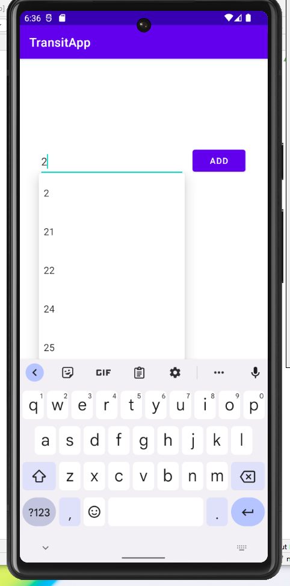

# TransitApp — Android Transit Application

TransitApp is a Kotlin-based Android app that displays nearby bus routes and alerts using GTFS transit data. The app demonstrates **API integration, local storage, asynchronous data handling, and user notifications** on a mobile platform.

---

## Overview

TransitApp allows users to:
- View nearby bus routes on a map
- Search and save favorite routes
- Receive local notifications for route alerts
- Persist saved routes using internal storage

This project emphasizes **mobile backend integration and data-driven features** rather than frontend complexity.

---

## Core Features

- Fetches transit data asynchronously via **Retrofit API**
- Displays user location and nearby routes on an interactive map
- Enables users to **save favorite routes locally**
- Sends **local notifications** for alerts using GTFS schedule updates
- Handles Android permissions and lifecycle for location and notifications

---

## Technology Stack

- Kotlin / Android SDK  
- Retrofit for API requests  
- GTFS public transit data  
- Internal storage for user data  
- Local notifications for alerts  
- Android Maps integration  

---

## Screenshots

### User Interface & Functionality

---

## Key Takeaways

- Mobile development with Kotlin and Android SDK  
- API integration and asynchronous network handling  
- Local data persistence and notifications  
- Demonstrates breadth beyond web-based backend projects
